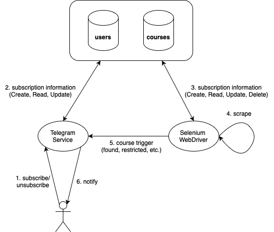

# Terrier Alert

A Python Selenium script which scrapes BU's course portal for specific classes and sends a notification via [Telegram](https://telegram.org/) bot when a class is open.

Deployed to Heroku.

## Demo

## System Design Overview

## Technical Details

Database is a MongoDB Atlas Cluster.  
There are two collections: _courses_ and _users_.

Each document in the _courses_ collection has the following schema:

- \_id: `ObjectId`
- name: `String`
- users: `String[]`

Each document in the _users_ collection has the following schema:

- \_id: `ObjectId`
- user: `String`
- last_subscribed: `Date`
- is_subscribed: `Boolean`
- last_subscription: `String`
